# 08 — Inside the impl mirror (`impl_common.rs`)

[02](02-pymap-and-codegen.md#exposing-impl-block-methods-the-impl-mirrors)
describes *what* the impl mirrors produce. This page describes *how*
`pliron-python-derive/src/impl_common.rs` produces it: every stage, every
type, every decision, and every place where one part depends on another.

If you only want to know how to use `#[py_type_impl]` & co., stop at 02. Read
this page when you need to change the generator or work out why it generated
what it did.

---

## Contents

1. [Where it sits](#1-where-it-sits)
2. [The whole pipeline on one page](#2-the-whole-pipeline-on-one-page)
3. [What comes out: the output layout](#3-what-comes-out-the-output-layout)
4. [The data model](#4-the-data-model)
5. [Stage 0: parse the `impl` and name the wrapper](#5-stage-0-parse-the-impl-and-name-the-wrapper)
6. [Stage 1: select the `pub fn`s](#6-stage-1-select-the-pub-fns)
7. [Stage 2: normalise the signature](#7-stage-2-normalise-the-signature)
8. [Stage 3: analyse the method](#8-stage-3-analyse-the-method)
9. [Stage 4: emit the wrapper](#9-stage-4-emit-the-wrapper)
10. [The three kinds (`ImplKind` adapters)](#10-the-three-kinds-implkind-adapters)
11. [Worked traces](#11-worked-traces)
12. [Error catalogue](#12-error-catalogue)
13. [Invariants, gotchas and known limitations](#13-invariants-gotchas-and-known-limitations)
14. [How to change things](#14-how-to-change-things)
15. [Test map](#15-test-map)

---

## 1. Where it sits

Six public macros end up in one function, `gen_impl`. The only thing that
differs between them is the `ImplKind` value they pass, plus whether the
original `impl` block is re-emitted.

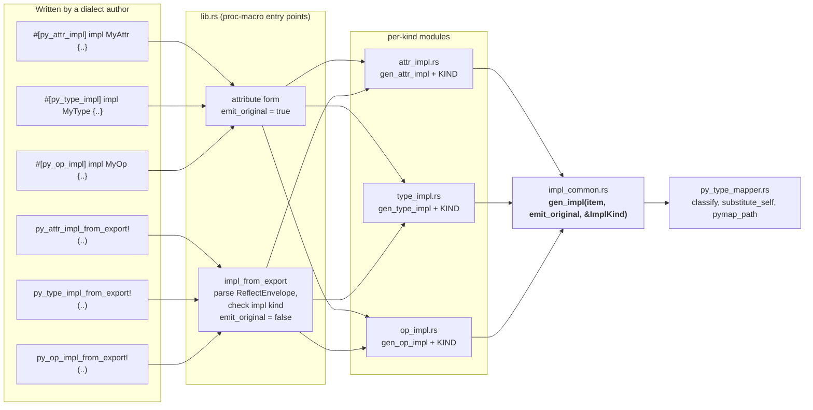
```mermaid
flowchart LR
  subgraph user["Written by a dialect author"]
    A1["#[py_attr_impl] impl MyAttr {..}"]
    A2["#[py_type_impl] impl MyType {..}"]
    A3["#[py_op_impl] impl MyOp {..}"]
    E1["py_attr_impl_from_export!(..)"]
    E2["py_type_impl_from_export!(..)"]
    E3["py_op_impl_from_export!(..)"]
  end

  subgraph lib["lib.rs (proc-macro entry points)"]
    L1["attribute form<br/>emit_original = true"]
    L2["impl_from_export<br/>parse ReflectEnvelope,<br/>check impl kind<br/>emit_original = false"]
  end

  subgraph kinds["per-kind modules"]
    K1["attr_impl.rs<br/>gen_attr_impl + KIND"]
    K2["type_impl.rs<br/>gen_type_impl + KIND"]
    K3["op_impl.rs<br/>gen_op_impl + KIND"]
  end

  G["impl_common.rs<br/><b>gen_impl(item, emit_original, &ImplKind)</b>"]
  M["py_type_mapper.rs<br/>classify, substitute_self, pymap_path"]

  A1 --> L1 --> K1
  A2 --> L1 --> K2
  A3 --> L1 --> K3
  E1 --> L2 --> K1
  E2 --> L2 --> K2
  E3 --> L2 --> K3
  K1 --> G
  K2 --> G
  K3 --> G
  G --> M
```

- **Attribute form** (`#[py_type_impl]` on an `impl` in *your* crate): the
  original `impl` must still be compiled, so it is re-emitted
  (`emit_original = true`).
- **Export form** (`py_type_impl_from_export!`): the `impl` lives in another
  crate (e.g. `pliron` itself) and was exported as tokens by
  `#[pliron_*_impl]`. It must **not** be emitted again
  (`emit_original = false`). See [02](02-pymap-and-codegen.md#the-reflect-export-mechanism)
  for the envelope.
- `lib.rs::to_token_stream` turns an `Err` from `gen_impl` into a single
  `compile_error!`. That only happens for whole-`impl` failures (see
  [§12](#12-error-catalogue)). Per-method failures never reach it.

`impl_common.rs` depends on `py_type_mapper.rs` for three things:

| Helper | Used for |
|---|---|
| `classify(&Type) -> Option<ParamKind>` | deciding how each parameter and return value crosses into Python |
| `substitute_self(&Type, &Ident) -> Type` | replacing `Self` in types |
| `pymap_path()` | the tokens `::pliron_python::PyMap` |

---

## 2. The whole pipeline on one page

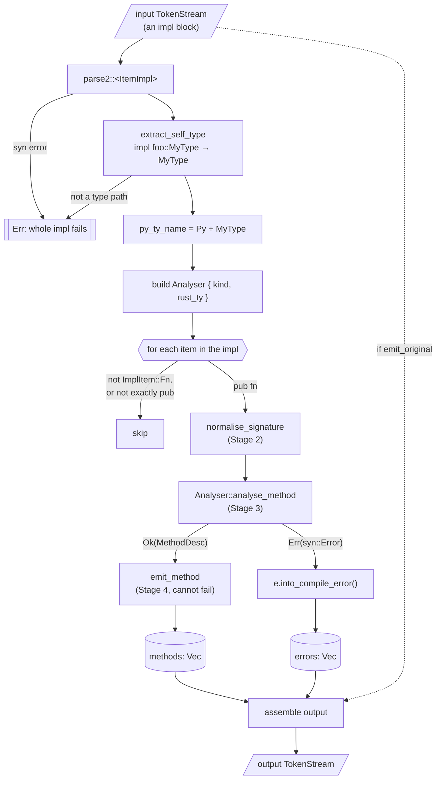
```mermaid
flowchart TD
  IN[/"input TokenStream<br/>(an impl block)"/] --> P["parse2::&lt;ItemImpl&gt;"]
  P -->|"syn error"| ERRW[["Err: whole impl fails"]]
  P --> ST["extract_self_type<br/>impl foo::MyType → MyType"]
  ST -->|"not a type path"| ERRW
  ST --> NAME["py_ty_name = Py + MyType"]
  NAME --> AN["build Analyser { kind, rust_ty }"]
  AN --> LOOP{{"for each item in the impl"}}

  LOOP -->|"not ImplItem::Fn,<br/>or not exactly pub"| SKIP["skip"]
  LOOP -->|"pub fn"| NORM["normalise_signature<br/>(Stage 2)"]
  NORM --> ANA["Analyser::analyse_method<br/>(Stage 3)"]
  ANA -->|"Ok(MethodDesc)"| EMIT["emit_method<br/>(Stage 4, cannot fail)"]
  ANA -->|"Err(syn::Error)"| CE["e.into_compile_error()"]
  EMIT --> METHODS[("methods: Vec")]
  CE --> ERRORS[("errors: Vec")]

  METHODS --> ASM["assemble output"]
  ERRORS --> ASM
  IN -.->|"if emit_original"| ASM
  ASM --> OUT[/"output TokenStream"/]
```

The two important properties:

1. **A bad method doesn't break the others.** Analysis errors are caught per
   method and turned into a `compile_error!`, and the loop continues.
2. **Emission cannot fail.** Every decision that can go wrong is made in
   analysis. By the time `emit_method` runs, everything it needs is in a
   `MethodDesc`.

---

## 3. What comes out: the output layout

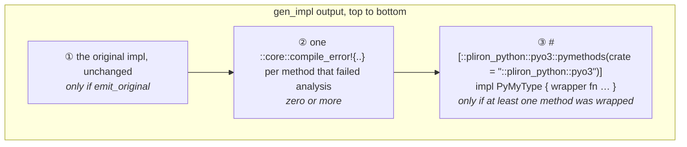
```mermaid
flowchart TB
  subgraph out["gen_impl output, top to bottom"]
    O1["① the original impl, unchanged<br/><i>only if emit_original</i>"]
    O2["② one ::core::compile_error!{..} per method that failed analysis<br/><i>zero or more</i>"]
    O3["③ #[::pliron_python::pyo3::pymethods(crate = &quot;::pliron_python::pyo3&quot;)]<br/>impl PyMyType { wrapper fn … }<br/><i>only if at least one method was wrapped</i>"]
  end
  O1 --> O2 --> O3
```

Why this layout:

- **Errors go outside the `#[pymethods]` block.** pyo3's `#[pymethods]`
  rejects macro invocations as items, so a `compile_error!` inside it would be
  replaced by a pyo3 error that hides the real one. This is why `PyMethods`
  keeps `methods` and `errors` in separate vectors.
- **An empty block is not emitted.** If every method failed or was skipped,
  there is no `impl PyMyType {}` at all.
- **`crate = "::pliron_python::pyo3"`** means downstream dialect crates don't
  need a direct `pyo3` dependency. Everything is reached through
  `pliron_python`'s re-export.

The generated block implements methods on `PyMyType`. That struct is **not**
created here. It comes from the class generators (`type_class.rs`,
`attr_class.rs`, `op_class.rs`), which must have run for the same type. The
field names the kinds use (`self.inner`, `self.ptr`) are defined there. See
[§10](#10-the-three-kinds-implkind-adapters).

---

## 4. The data model

All types, and which stage creates or reads each one.

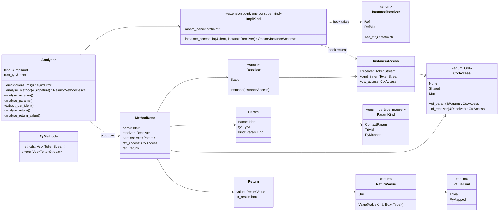
```mermaid
classDiagram
  direction LR

  class ImplKind {
    <<extension point, one const per kind>>
    +macro_name: static str
    +instance_access: fn(&Ident, InstanceReceiver) Option~InstanceAccess~
  }

  class InstanceReceiver {
    <<enum>>
    Ref
    RefMut
    +as_str() static str
  }

  class InstanceAccess {
    +receiver: TokenStream
    +bind_inner: TokenStream
    +ctx_access: CtxAccess
  }

  class CtxAccess {
    <<enum, Ord>>
    None
    Shared
    Mut
    +of_param(&Param) CtxAccess
    +of_receiver(&Receiver) CtxAccess
  }

  class Analyser {
    kind: &ImplKind
    rust_ty: &Ident
    +error(tokens, msg) syn::Error
    +analyse_method(&Signature) Result~MethodDesc~
    -analyse_receiver()
    -analyse_params()
    -extract_pat_ident()
    -analyse_return()
    -analyse_return_value()
  }

  class MethodDesc {
    name: Ident
    receiver: Receiver
    params: Vec~Param~
    ctx_access: CtxAccess
    ret: Return
  }

  class Receiver {
    <<enum>>
    Static
    Instance(InstanceAccess)
  }

  class Param {
    name: Ident
    ty: Type
    kind: ParamKind
  }

  class ParamKind {
    <<enum, py_type_mapper>>
    ContextParam
    Trivial
    PyMapped
  }

  class Return {
    value: ReturnValue
    in_result: bool
  }

  class ReturnValue {
    <<enum>>
    Unit
    Value(ValueKind, Box~Type~)
  }

  class ValueKind {
    <<enum>>
    Trivial
    PyMapped
  }

  class PyMethods {
    methods: Vec~TokenStream~
    errors: Vec~TokenStream~
  }

  ImplKind ..> InstanceReceiver : hook takes
  ImplKind ..> InstanceAccess : hook returns
  InstanceAccess --> CtxAccess
  Analyser --> ImplKind
  Analyser ..> MethodDesc : produces
  MethodDesc --> Receiver
  MethodDesc --> Param
  MethodDesc --> CtxAccess
  MethodDesc --> Return
  Receiver --> InstanceAccess
  Param --> ParamKind
  Return --> ReturnValue
  ReturnValue --> ValueKind
```

### Who touches what

| Type | Visibility | Created by | Read by |
|---|---|---|---|
| `ImplKind` | `pub(crate)` | each kind module, as a `const KIND` | `gen_impl` → `Analyser` |
| `InstanceReceiver` | `pub(crate)` | `Analyser::analyse_receiver` | the kind's `instance_access` hook |
| `InstanceAccess` | `pub(crate)` | the kind's `instance_access` hook | `CtxAccess::of_receiver`, `emit_method` |
| `CtxAccess` | `pub(crate)` | kinds (in `InstanceAccess`), `CtxAccess::of_param` | `emit_method` |
| `Analyser` | private | `gen_impl` | `gen_py_methods` |
| `MethodDesc` & its parts | private | `Analyser::analyse_method` | `emit_method` |
| `PyMethods` | private | `gen_py_methods` | `gen_impl` |

Only the first four are visible outside the file, because the kind modules
need them to write their `const KIND`.

### Why `ValueKind` is not just `ParamKind`

`ParamKind` has three variants, one of which (`ContextParam`) is an error for
a return value. Analysis turns `ContextParam` into an error and maps the other
two onto `ValueKind`. As a result, "returns a `&Context`" can't reach
emission at all.

### Why `ReturnValue::Unit` is separate

`classify(&())` says `PyMapped`, because `()` is a tuple type, not a
recognised primitive. Converting `()` through `PyMap` would be wrong, and
pyo3 already knows `()`. So unit is checked **before** `classify` and gets its
own variant (see [§8.4](#84-analysing-the-return-type)).

---

## 5. Stage 0: parse the `impl` and name the wrapper


```mermaid
flowchart LR
  T["impl foo::bar::IntegerType { .. }"] --> S["self_ty =<br/>Type::Path(foo::bar::IntegerType)"]
  S --> L["last path segment<br/>IntegerType"]
  L --> R["rust_ty = IntegerType"]
  R --> P["py_ty_name = PyIntegerType"]
```

`extract_self_type` takes the **last segment's identifier only**:

| `impl` header | `rust_ty` | wrapper | notes |
|---|---|---|---|
| `impl IntegerType` | `IntegerType` | `PyIntegerType` | normal case |
| `impl builtin::IntegerType` | `IntegerType` | `PyIntegerType` | path prefix is dropped |
| `impl Foo<T>` | `Foo` | `PyFoo` | generic arguments are dropped (see [§13](#13-invariants-gotchas-and-known-limitations)) |
| `impl &IntegerType` | — | — | **whole-impl error**: `py_type_impl requires a concrete type path (e.g. \`impl MyType\`)` |

This error is reported through the normal `?` from `gen_impl`, not per method,
because nothing can be generated without a self type. Its message is the only
one written as `"<macro> requires …"` instead of `"<macro>: …"`, because it
is built before an `Analyser` exists.

`rust_ty` is then used in three places:

1. `normalise_signature`, which replaces `Self` with it;
2. the kind's `instance_access` hook (the op kind writes
   `<#rust_ty as Op>::from_operation(..)`);
3. `emit_method`, for static calls `#rust_ty::#name(..)`.

---

## 6. Stage 1: select the `pub fn`s

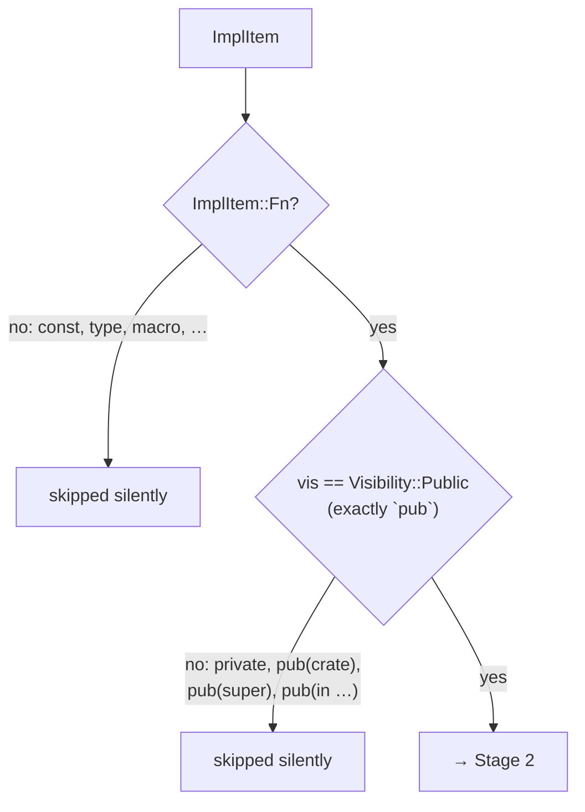
```mermaid
flowchart TD
  I["ImplItem"] --> F{"ImplItem::Fn?"}
  F -->|no: const, type, macro, …| X1["skipped silently"]
  F -->|yes| V{"vis == Visibility::Public<br/>(exactly `pub`)"}
  V -->|"no: private, pub(crate),<br/>pub(super), pub(in …)"| X2["skipped silently"]
  V -->|yes| K["→ Stage 2"]
```

`pub(crate)` is `Visibility::Restricted`, **not** `Public`, so restricted
methods are never exposed. This is deliberate: exposing to Python is treated
as the most public API a method can have.

---

## 7. Stage 2: normalise the signature

`normalise_signature(&sig, rust_ty)` returns a **copy**. The original tokens
stay untouched, because the `emit_original` path re-emits `input` exactly as
written.

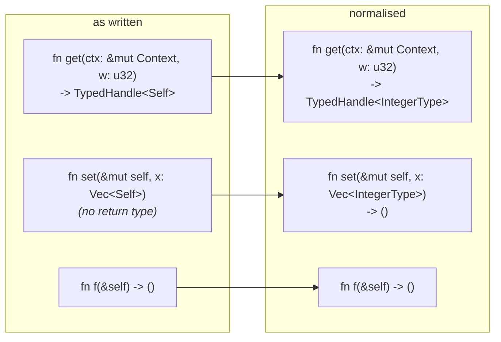
```mermaid
flowchart LR
  subgraph before["as written"]
    B1["fn get(ctx: &mut Context, w: u32)<br/>-> TypedHandle&lt;Self&gt;"]
    B2["fn set(&mut self, x: Vec&lt;Self&gt;)<br/><i>(no return type)</i>"]
    B3["fn f(&self) -> ()"]
  end
  subgraph after["normalised"]
    A1["fn get(ctx: &mut Context, w: u32)<br/>-> TypedHandle&lt;IntegerType&gt;"]
    A2["fn set(&mut self, x: Vec&lt;IntegerType&gt;)<br/>-> ()"]
    A3["fn f(&self) -> ()"]
  end
  B1 --> A1
  B2 --> A2
  B3 --> A3
```

Two rewrites:

| Rewrite | Applies to | Does not apply to |
|---|---|---|
| `Self` → `rust_ty` (via `substitute_self`) | every typed parameter's type; the return type | the receiver (`self`, `&self`, `&mut self`) |
| omitted return → `-> ()` | `ReturnType::Default` | explicit return types |

`substitute_self` walks these type shapes recursively:

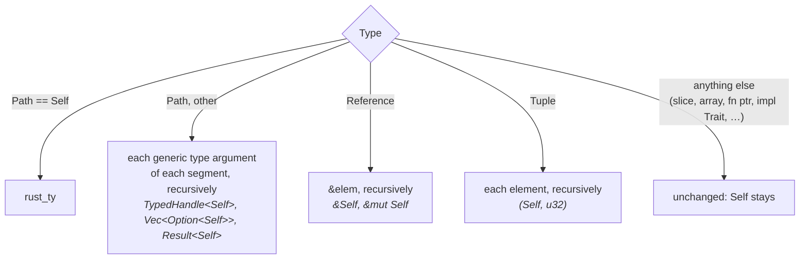
```mermaid
flowchart TD
  T{"Type"} -->|"Path == Self"| C["rust_ty"]
  T -->|"Path, other"| G["each generic type argument<br/>of each segment, recursively<br/><i>TypedHandle&lt;Self&gt;, Vec&lt;Option&lt;Self&gt;&gt;, Result&lt;Self&gt;</i>"]
  T -->|"Reference"| R["&amp;elem, recursively<br/><i>&amp;Self, &amp;mut Self</i>"]
  T -->|"Tuple"| U["each element, recursively<br/><i>(Self, u32)</i>"]
  T -->|"anything else<br/>(slice, array, fn ptr, impl Trait, …)"| N["unchanged: Self stays"]
```

**Why this stage exists:** afterwards, analysis and emission never see `Self`
and never see an omitted return, so there is exactly one form of "returns
unit". Before this stage existed, an explicit `-> ()` and an omitted return
took different code paths, and one of them generated `Ok()`, which does not
compile (regression test: `type_impl::explicit_unit_return`).

---

## 8. Stage 3: analyse the method

`Analyser::analyse_method(&normalised_sig) -> syn::Result<MethodDesc>`

### 8.1 Order of the steps

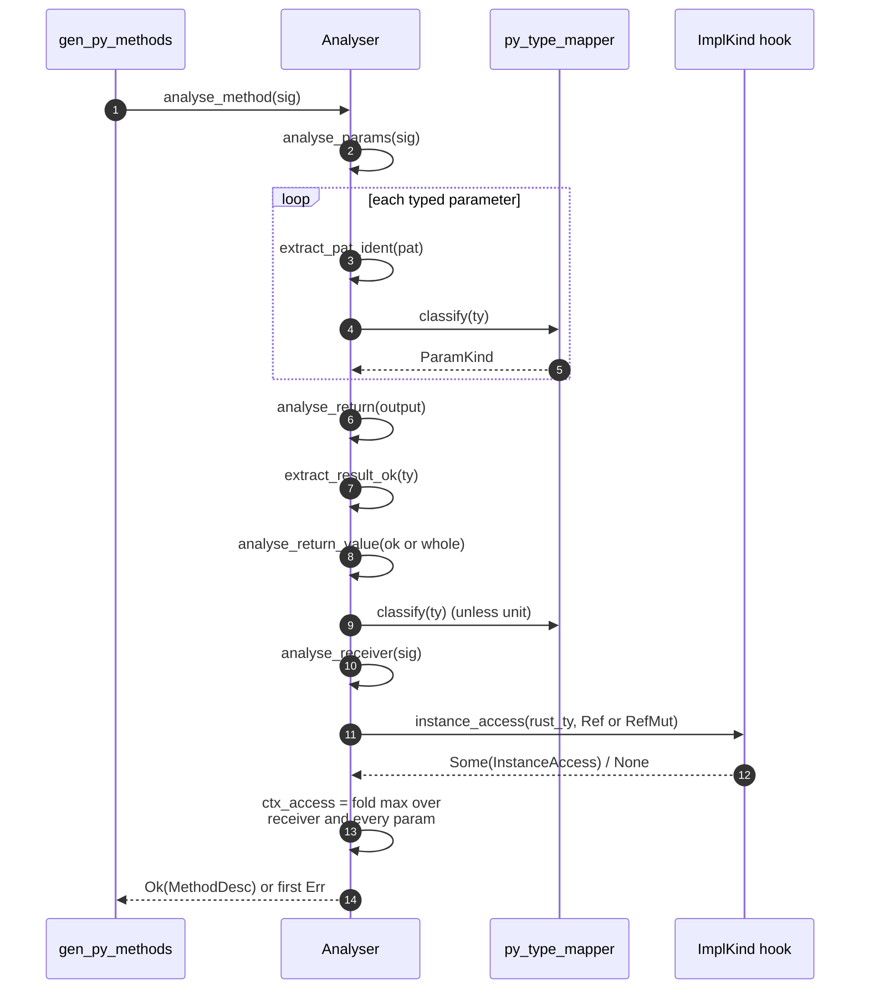
```mermaid
sequenceDiagram
  autonumber
  participant G as gen_py_methods
  participant A as Analyser
  participant M as py_type_mapper
  participant K as ImplKind hook

  G->>A: analyse_method(sig)
  A->>A: analyse_params(sig)
  loop each typed parameter
    A->>A: extract_pat_ident(pat)
    A->>M: classify(ty)
    M-->>A: ParamKind
  end
  A->>A: analyse_return(output)
  A->>A: extract_result_ok(ty)
  A->>A: analyse_return_value(ok or whole)
  A->>M: classify(ty) (unless unit)
  A->>A: analyse_receiver(sig)
  A->>K: instance_access(rust_ty, Ref or RefMut)
  K-->>A: Some(InstanceAccess) / None
  A->>A: ctx_access = fold max over<br/>receiver and every param
  A-->>G: Ok(MethodDesc) or first Err
```

Each step uses `?`, so **only the first error per method is reported**, in
the order parameters → return → receiver. For example, a `&mut self` method
on a type that also has a tuple-pattern parameter reports the pattern error,
not the receiver error.

### 8.2 Analysing parameters

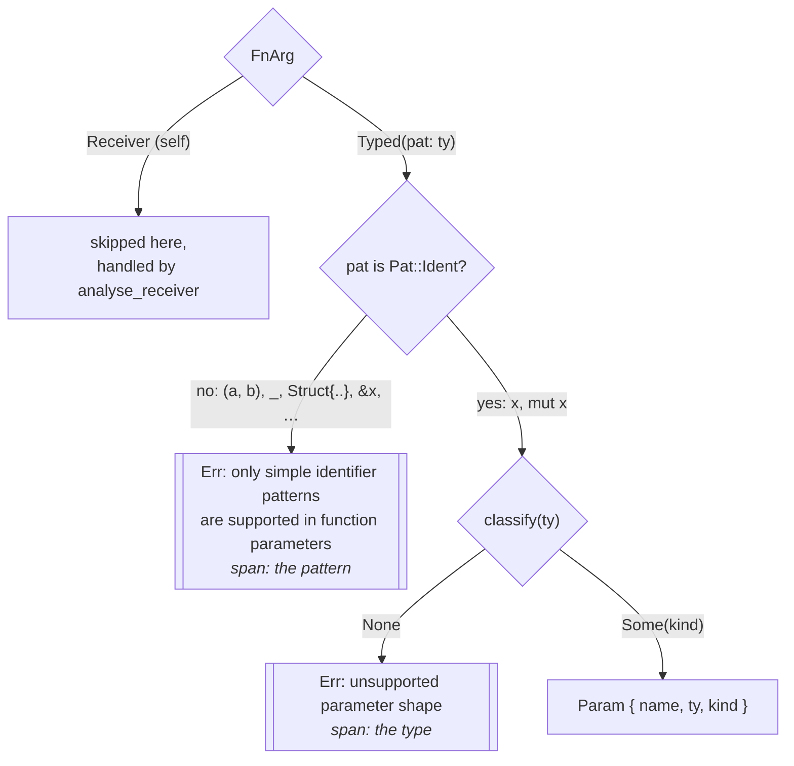
```mermaid
flowchart TD
  ARG{"FnArg"} -->|"Receiver (self)"| SKIP["skipped here,<br/>handled by analyse_receiver"]
  ARG -->|"Typed(pat: ty)"| PAT{"pat is Pat::Ident?"}
  PAT -->|"no: (a, b), _, Struct{..}, &x, …"| E1[["Err: only simple identifier patterns<br/>are supported in function parameters<br/><i>span: the pattern</i>"]]
  PAT -->|"yes: x, mut x"| CL{"classify(ty)"}
  CL -->|"None"| E2[["Err: unsupported parameter shape<br/><i>span: the type</i>"]]
  CL -->|"Some(kind)"| OK["Param { name, ty, kind }"]
```

`mut x: T` is accepted: `Pat::Ident` covers `mut`, and only the identifier
is kept, which is fine because the wrapper passes `x` by value.

`classify` today never returns `None` (see below), so `E2` can't currently
happen. It is kept in case `classify` becomes stricter later.

### 8.3 How `classify` decides (from `py_type_mapper.rs`)

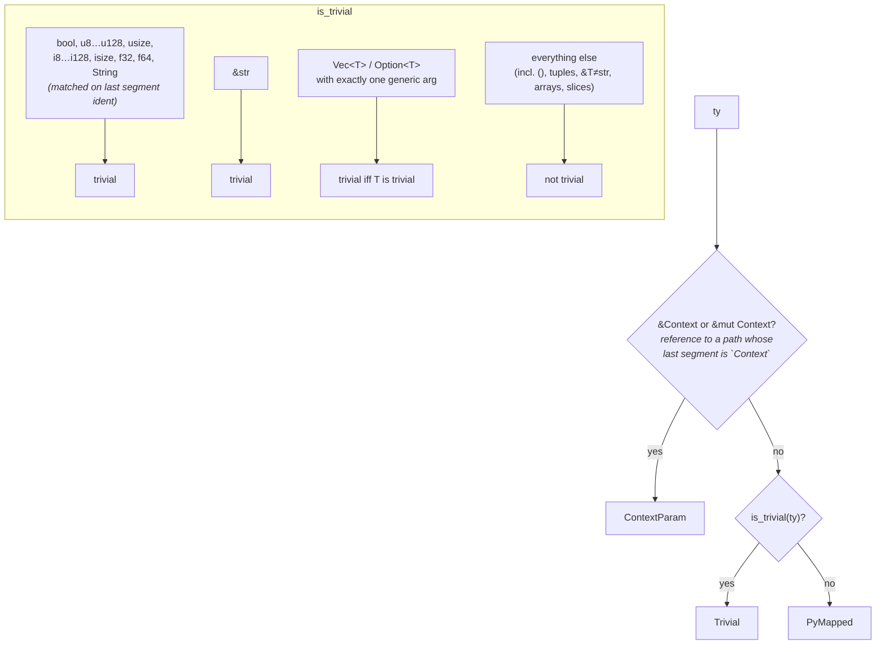
```mermaid
flowchart TD
  T["ty"] --> C{"&amp;Context or &amp;mut Context?<br/><i>reference to a path whose<br/>last segment is `Context`</i>"}
  C -->|yes| CP["ContextParam"]
  C -->|no| TR{"is_trivial(ty)?"}
  TR -->|yes| TV["Trivial"]
  TR -->|no| PM["PyMapped"]

  subgraph triv["is_trivial"]
    direction TB
    X1["bool, u8…u128, usize,<br/>i8…i128, isize, f32, f64, String<br/><i>(matched on last segment ident)</i>"] --> YES1["trivial"]
    X2["&amp;str"] --> YES2["trivial"]
    X3["Vec&lt;T&gt; / Option&lt;T&gt;<br/>with exactly one generic arg"] --> REC["trivial iff T is trivial"]
    X4["everything else<br/>(incl. (), tuples, &amp;T≠str, arrays, slices)"] --> NO["not trivial"]
  end
```

What each kind means for the wrapper:

| `ParamKind` | Parameter in Python signature | Argument passed to Rust | Return (if allowed) |
|---|---|---|---|
| `ContextParam` | **dropped** | `ctx` | error |
| `Trivial` | `name: Ty` (pyo3 converts natively) | `name` | `Ty`, value unchanged |
| `PyMapped` | `name: <Ty as PyMap>::Borrowed<'_>` | `<Ty as PyMap>::from_py(name)` | `<Ty as PyMap>::Owned` via `into_py` |

### 8.4 Analysing the return type

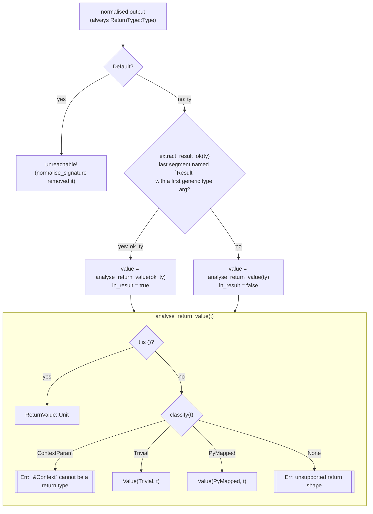
```mermaid
flowchart TD
  R["normalised output<br/>(always ReturnType::Type)"] --> D{"Default?"}
  D -->|"yes"| UR["unreachable!<br/>(normalise_signature removed it)"]
  D -->|"no: ty"| RES{"extract_result_ok(ty)<br/>last segment named `Result`<br/>with a first generic type arg?"}
  RES -->|"yes: ok_ty"| V1["value = analyse_return_value(ok_ty)<br/>in_result = true"]
  RES -->|"no"| V2["value = analyse_return_value(ty)<br/>in_result = false"]

  V1 --> ARV
  V2 --> ARV
  subgraph ARV["analyse_return_value(t)"]
    direction TB
    U{"t is ()?"} -->|yes| UNIT["ReturnValue::Unit"]
    U -->|no| CL{"classify(t)"}
    CL -->|"ContextParam"| E1[["Err: `&amp;Context` cannot be a return type"]]
    CL -->|"Trivial"| VT["Value(Trivial, t)"]
    CL -->|"PyMapped"| VP["Value(PyMapped, t)"]
    CL -->|"None"| E2[["Err: unsupported return shape"]]
  end
```

`Result` detection is based only on the name: any path whose last segment is
`Result` and whose first generic argument is a type. It matches `Result<T>`
(pliron's alias), `Result<T, E>`, `std::result::Result<T, E>` and
`pliron::result::Result<T>`. The error type is ignored in the analysis, but
the generated `.map_err(::pliron_python::to_py_err)` requires it to be
`pliron::result::Error` (see [§13](#13-invariants-gotchas-and-known-limitations)).

All possible `Return` values:

| Rust return (after normalising) | `value` | `in_result` |
|---|---|---|
| `()` | `Unit` | false |
| `u32`, `String`, `Vec<u64>` | `Value(Trivial, ty)` | false |
| `Self`, `TypedHandle<Self>`, `Vec<TypedHandle<Self>>` | `Value(PyMapped, ty)` | false |
| `Result<()>` | `Unit` | true |
| `Result<u32>` | `Value(Trivial, u32)` | true |
| `Result<Self, Error>` | `Value(PyMapped, MyType)` | true |
| `&Context` / `Result<&Context>` | — error — | — |

### 8.5 Analysing the receiver

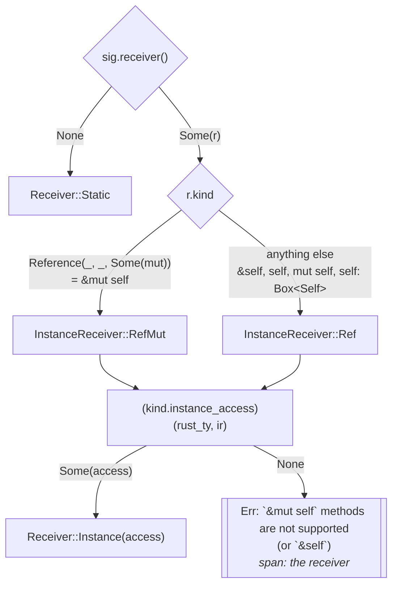
```mermaid
flowchart TD
  S{"sig.receiver()"} -->|"None"| ST["Receiver::Static"]
  S -->|"Some(r)"| KIND{"r.kind"}
  KIND -->|"Reference(_, _, Some(mut))<br/>= &amp;mut self"| RM["InstanceReceiver::RefMut"]
  KIND -->|"anything else<br/>&amp;self, self, mut self, self: Box&lt;Self&gt;"| RR["InstanceReceiver::Ref"]
  RM --> HOOK["(kind.instance_access)(rust_ty, ir)"]
  RR --> HOOK
  HOOK -->|"Some(access)"| INST["Receiver::Instance(access)"]
  HOOK -->|"None"| ERR[["Err: `&amp;mut self` methods are not supported<br/>(or `&amp;self`)<br/><i>span: the receiver</i>"]]
```

`Receiver::mutability` is the `mut` in `mut self` (a mutable *binding*), not
the `mut` in `&mut self`. That's why the code looks inside `ReceiverKind`
instead.

The hook is where the kinds differ. Its result carries three things the
generator itself doesn't know: what the wrapper's own receiver is, how to get
the Rust value into `__inner`, and whether doing that needs `ctx`.
[§10](#10-the-three-kinds-implkind-adapters) has the table.

### 8.6 Combining the context need

Every part of a method may need the active `Context`. `CtxAccess` is ordered
`None < Shared < Mut`, and the method's need is the **maximum** of its parts:

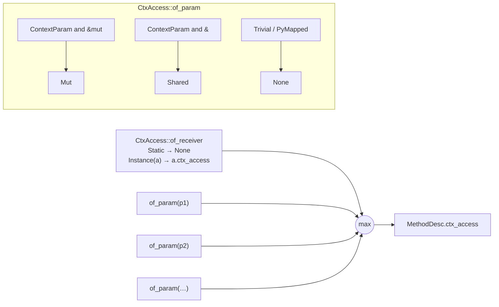
```mermaid
flowchart LR
  R["CtxAccess::of_receiver<br/>Static → None<br/>Instance(a) → a.ctx_access"] --> MAX(("max"))
  P1["of_param(p1)"] --> MAX
  P2["of_param(p2)"] --> MAX
  PN["of_param(…)"] --> MAX
  MAX --> OUT["MethodDesc.ctx_access"]

  subgraph ofp["CtxAccess::of_param"]
    direction TB
    Q1["ContextParam and &amp;mut"] --> MUT["Mut"]
    Q2["ContextParam and &amp;"] --> SH["Shared"]
    Q3["Trivial / PyMapped"] --> NO["None"]
  end
```


```mermaid
flowchart LR
  None -->|"&lt;"| Shared -->|"&lt;"| Mut
```

Examples (all from tests):

| Kind | Method | receiver | params | result |
|---|---|---|---|---|
| attr | `fn value(&self) -> String` | None | — | **None** |
| attr | `fn new(value: String) -> Self` | None | None | **None** |
| type | `fn width(&self) -> u32` | Shared | — | **Shared** |
| type | `fn bump(&self, ctx: &mut Context)` | Shared | Mut | **Mut** |
| type | `fn get(ctx: &mut Context, w: u32)` | None | Mut, None | **Mut** |
| op | `fn get_name(&self, ctx: &Context)` | None | Shared | **Shared** |
| op | `fn rename(&mut self, ctx: &Context, ..)` | None | Shared, None | **Shared** |
| op | `fn set_name(&mut self, ctx: &mut Context, ..)` | None | Mut, None | **Mut** |

`ctx_access` controls two things in emission: **which getter** is called, and
**whether the wrapper is fallible** (`None` means infallible; `Shared`/`Mut`
use `?`, so the wrapper must return `PyResult`).

---

## 9. Stage 4: emit the wrapper

`emit_method(&MethodDesc, rust_ty) -> TokenStream` cannot fail. It fills one
template:

```text
 ┌───────────────────────────────────────────────────────────────────────┐
 │ #static_attr                          ← ① receiver                    │
 │ fn #name( #self_param  #py_params )   ← ① receiver, ② params          │
 │     -> #py_ret_ty                     ← ⑤ return matrix               │
 │ {                                                                     │
 │     #fetch_ctx                        ← ③ ctx_access                  │
 │     #bind_inner                       ← ① receiver (from ImplKind)    │
 │     let __result = #call_expr;        ← ① receiver, ② call_args       │
 │     #wrap_result                      ← ⑤ return matrix               │
 │ }                                                                     │
 └───────────────────────────────────────────────────────────────────────┘
```

### 9.1 The local-variable contract

Everything inside the body depends on four names. `emit_method` is the only
code that writes them, **except `__inner`, which the kind's `bind_inner`
defines**, and `ctx`, which the kind's `bind_inner` may read.

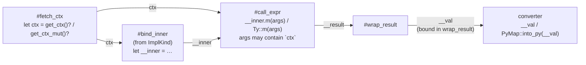
```mermaid
flowchart LR
  FC["#fetch_ctx<br/>let ctx = get_ctx()? / get_ctx_mut()?"] -->|"ctx"| BI["#bind_inner<br/>(from ImplKind)<br/>let __inner = …"]
  FC -->|"ctx"| CALL["#call_expr<br/>__inner.m(args) / Ty::m(args)<br/>args may contain `ctx`"]
  BI -->|"__inner"| CALL
  CALL -->|"__result"| WR["#wrap_result"]
  WR -->|"__val<br/>(bound in wrap_result)"| CONV["converter<br/>__val / PyMap::into_py(__val)"]
```

| Local | Defined by | Present when | Read by |
|---|---|---|---|
| `ctx` | `#fetch_ctx` | `ctx_access != None` | `bind_inner` (type kind), `call_expr` (context params) |
| `__inner` | kind's `bind_inner` | instance methods | `call_expr` |
| `__result` | template | always | `wrap_result` |
| `__val` | `wrap_result` (`let __val = __result;` or closure arg) | non-unit values, and `Result` of unit | converter |

This is the one real coupling between the kinds and `impl_common.rs`: a kind's
`bind_inner` **must** bind exactly `__inner`, and may use `ctx` **only** if it
sets `ctx_access` above `None`. Nothing checks this at macro time. A mistake
shows up as a compile error in the generated code.

### 9.2 ① Receiver

| `Receiver` | `#static_attr` | `#self_param` | `#bind_inner` | `#call_expr` |
|---|---|---|---|---|
| `Static` | `#[staticmethod]` | *(empty)* | *(empty)* | `#rust_ty::#name(#call_args)` |
| `Instance(a)` | *(empty)* | `#(a.receiver),` | `a.bind_inner` | `__inner.#name(#call_args)` |

Note the trailing comma in `#self_param` (`&self,`). It makes
`fn m(&self, x: u32)` and `fn m(&self,)` both valid, so the parameter list
needs no special cases.

### 9.3 ② Parameters

Each `Param` contributes to two lists:

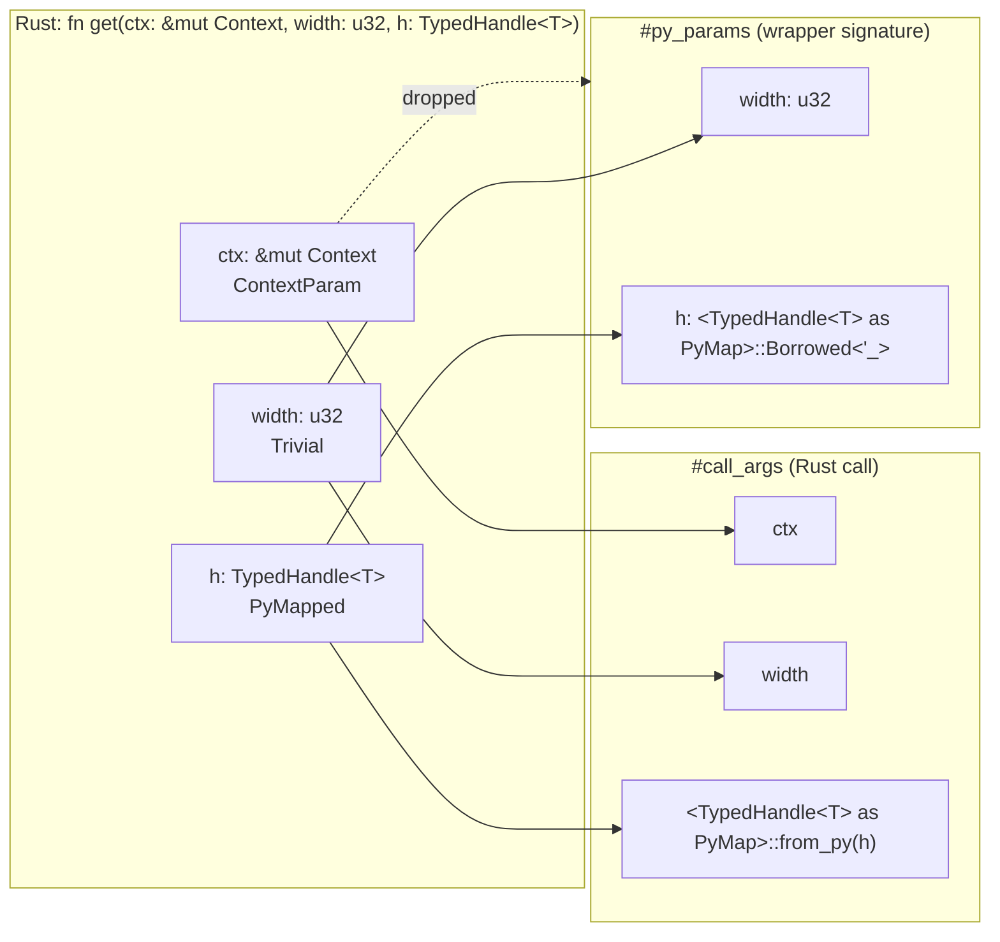
```mermaid
flowchart LR
  subgraph rust["Rust: fn get(ctx: &amp;mut Context, width: u32, h: TypedHandle&lt;T&gt;)"]
    P1["ctx: &amp;mut Context<br/>ContextParam"]
    P2["width: u32<br/>Trivial"]
    P3["h: TypedHandle&lt;T&gt;<br/>PyMapped"]
  end
  subgraph py["#py_params (wrapper signature)"]
    Y2["width: u32"]
    Y3["h: &lt;TypedHandle&lt;T&gt; as PyMap&gt;::Borrowed&lt;'_&gt;"]
  end
  subgraph call["#call_args (Rust call)"]
    C1["ctx"]
    C2["width"]
    C3["&lt;TypedHandle&lt;T&gt; as PyMap&gt;::from_py(h)"]
  end
  P1 -.->|"dropped"| py
  P1 --> C1
  P2 --> Y2
  P2 --> C2
  P3 --> Y3
  P3 --> C3
```

The call arguments keep the **original order**, including where the context
parameter was. Only the Python signature loses it.

### 9.4 ③ Context fetch

| `ctx_access` | `#fetch_ctx` | wrapper fallible? |
|---|---|---|
| `None` | *(empty)* | no |
| `Shared` | `let ctx = ::pliron_python::get_ctx()?;` | yes |
| `Mut` | `let ctx = ::pliron_python::get_ctx_mut()?;` | yes |

`get_ctx`/`get_ctx_mut` read the thread-local set up by `with pliron.Context():`
(see [01](01-architecture.md)). They fail with a Python exception when no
context is active. That's why fetching makes the wrapper return `PyResult`.

### 9.5 ④ Converting the value

When the return value isn't unit, it gets a Python type and a converter
expression over `__val`:

| `ReturnValue` | Python type (`py_ty`) | converter |
|---|---|---|
| `Unit` | — (no value) | — |
| `Value(Trivial, T)` | `T` | `__val` |
| `Value(PyMapped, T)` | `<T as PyMap>::Owned` | `<T as PyMap>::into_py(__val)` |

### 9.6 ⑤ The return matrix

Three independent facts determine the return type and the last statement:
is there a value, did Rust return a `Result`, and is the wrapper fallible
because it fetched `ctx`.

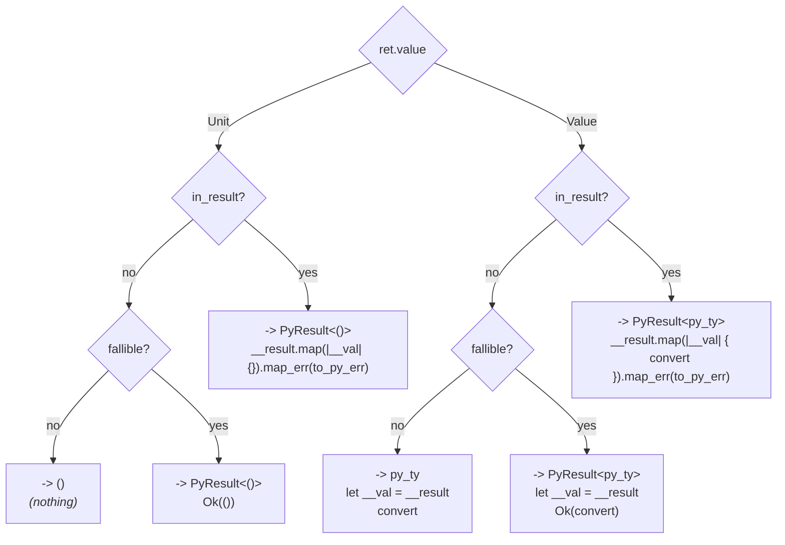
```mermaid
flowchart TD
  S{"ret.value"} -->|"Unit"| U{"in_result?"}
  S -->|"Value"| V{"in_result?"}

  U -->|"no"| UF{"fallible?"}
  UF -->|"no"| R1["-> ()<br/><i>(nothing)</i>"]
  UF -->|"yes"| R2["-> PyResult&lt;()&gt;<br/>Ok(())"]
  U -->|"yes"| R3["-> PyResult&lt;()&gt;<br/>__result.map(|__val| {}).map_err(to_py_err)"]

  V -->|"no"| VF{"fallible?"}
  VF -->|"no"| R4["-> py_ty<br/>let __val = __result<br/>convert"]
  VF -->|"yes"| R5["-> PyResult&lt;py_ty&gt;<br/>let __val = __result<br/>Ok(convert)"]
  V -->|"yes"| R6["-> PyResult&lt;py_ty&gt;<br/>__result.map(|__val| { convert }).map_err(to_py_err)"]
```

| # | value | `in_result` | fallible | return type | final statement(s) | test |
|---|---|---|---|---|---|---|
| R1 | unit | no | no | `()` | *(none)* | `attr::mut_self_method` |
| R2 | unit | no | yes | `PyResult<()>` | `Ok(())` | `type::explicit_unit_return`, `op::mut_self_method` |
| R3 | unit | yes | either | `PyResult<()>` | `__result.map(\|__val\| {}).map_err(to_py_err)` | `attr::result_returns_without_ctx`, `op::explicit_unit_return_with_ctx` |
| R4 | value | no | no | `py_ty` | `let __val = __result; convert` | `attr::static_and_instance_methods` |
| R5 | value | no | yes | `PyResult<py_ty>` | `let __val = __result; Ok(convert)` | `type::instance_and_static_methods` |
| R6 | value | yes | either | `PyResult<py_ty>` | `__result.map(\|__val\| { convert }).map_err(to_py_err)` | `type::self_in_result_and_vec`, `attr::result_returns_without_ctx` |

For R3 and R6 `fallible` doesn't matter: a `Result` already makes the
wrapper return `PyResult`, and the `?` on the context fetch fits the same
`PyResult`. In R1 the body ends with the `let __result = …;` statement, so the
function returns `()`. `__result` is intentionally unused.

### 9.7 The whole of emission as one picture

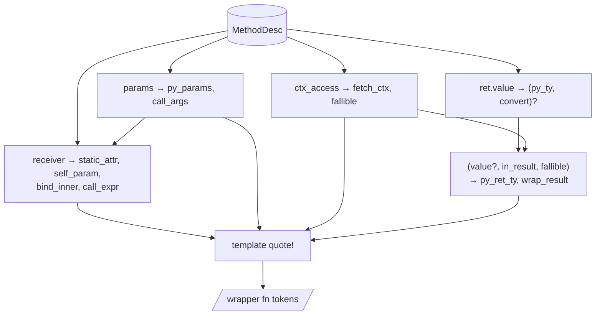
```mermaid
flowchart TB
  D[("MethodDesc")] --> RCV["receiver → static_attr, self_param,<br/>bind_inner, call_expr"]
  D --> PRM["params → py_params, call_args"]
  D --> CTX["ctx_access → fetch_ctx, fallible"]
  D --> RET["ret.value → (py_ty, convert)?"]
  RET --> MAT["(value?, in_result, fallible)<br/>→ py_ret_ty, wrap_result"]
  CTX --> MAT
  PRM --> RCV
  RCV --> TPL["template quote!"]
  PRM --> TPL
  CTX --> TPL
  MAT --> TPL
  TPL --> OUT[/"wrapper fn tokens"/]
```

---

## 10. The three kinds (`ImplKind` adapters)

Each kind is one `const KIND: ImplKind` in its own module. The generated
`Py<Name>` struct for each kind, defined by its class generator, stores the
Rust value differently, which is why their hooks differ:

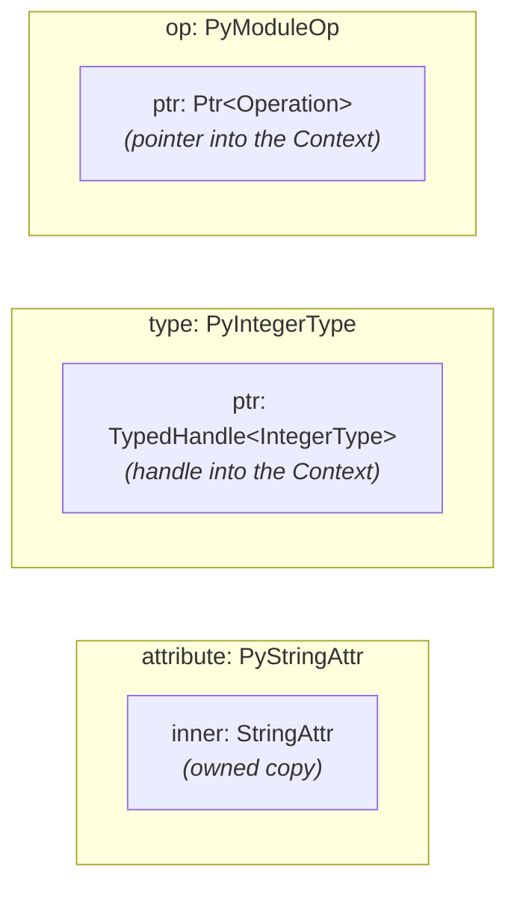
```mermaid
flowchart LR
  subgraph attr["attribute: PyStringAttr"]
    AF["inner: StringAttr<br/><i>(owned copy)</i>"]
  end
  subgraph type["type: PyIntegerType"]
    TF["ptr: TypedHandle&lt;IntegerType&gt;<br/><i>(handle into the Context)</i>"]
  end
  subgraph op["op: PyModuleOp"]
    OF["ptr: Ptr&lt;Operation&gt;<br/><i>(pointer into the Context)</i>"]
  end
```

### What each hook returns

| Kind | `InstanceReceiver` | wrapper `receiver` | `bind_inner` | `ctx_access` |
|---|---|---|---|---|
| **attr** (`py_attr_impl`) | `Ref` | `&self` | `let __inner = &self.inner;` | `None` |
| | `RefMut` | `&mut self` | `let __inner = &mut self.inner;` | `None` |
| **type** (`py_type_impl`) | `Ref` | `&self` | `let __inner = self.ptr.deref(ctx);` | `Shared` |
| | `RefMut` | — **`None`** → error | — | — |
| **op** (`py_op_impl`) | `Ref` | `&self` | `let __inner = <Op as ::pliron::op::Op>::from_operation(self.ptr);` | `None` |
| | `RefMut` | `&self` | `let mut __inner = <Op as ::pliron::op::Op>::from_operation(self.ptr);` | `None` |

Why each one looks the way it does:

- **attr**: the wrapper owns a copy of the attribute, so it borrows it
  directly. A `&mut self` Rust method mutates the wrapper's copy, so the
  wrapper also needs `&mut self`. pyo3 then takes a mutable borrow of the
  Python object.
- **type**: types are uniqued and immutable in the `Context`. Reaching the
  value means `TypedHandle::deref(ctx)`, which returns `Ref<T>`, so **every**
  instance method needs `ctx` and returns `PyResult`. `&mut self` has no
  meaning for a uniqued value, so it is rejected.
- **op**: an op struct is a cheap handle rebuilt from `Ptr<Operation>`, and
  its data lives in the `Context`. A `&mut self` method only needs a mutable
  *local*, and the wrapper itself stays `&self`. Rebuilding doesn't touch the
  context, so it needs none.

```mermaid
sequenceDiagram
  participant Py as Python caller
  participant W as wrapper fn (type kind, &self)
  participant C as thread-local Context
  participant R as Rust method

  Py->>W: obj.width()
  W->>C: get_ctx()?
  C-->>W: &Context (or PyErr if none active)
  W->>W: __inner = self.ptr.deref(ctx)
  W->>R: __inner.width()
  R-->>W: __result: u32
  W-->>Py: Ok(__val) → int
```

---

## 11. Worked traces

Each trace follows one method from input to output. All outputs are taken
from the snapshot tests.

### 11.1 Type, static, `&mut Context`, `Self` in the return

Input (`type_impl::instance_and_static_methods`):

```rust
impl IntegerType {
    pub fn get(ctx: &mut Context, width: u32) -> TypedHandle<Self> { .. }
}
```

```mermaid
flowchart TD
  N["normalise: -> TypedHandle&lt;IntegerType&gt;"] --> P["params:<br/>ctx: ContextParam (&amp;mut)<br/>width: Trivial"]
  P --> R["return: Value(PyMapped, TypedHandle&lt;IntegerType&gt;)<br/>in_result = false"]
  R --> RC["receiver: Static"]
  RC --> C["ctx_access = max(None, Mut, None) = Mut<br/>fallible = true"]
  C --> M["matrix row R5"]
```

`MethodDesc` (shape):

```text
MethodDesc {
  name: get,
  receiver: Static,
  params: [ Param { ctx,   &mut Context,  ContextParam },
            Param { width, u32,           Trivial      } ],
  ctx_access: Mut,
  ret: Return { value: Value(PyMapped, TypedHandle<IntegerType>), in_result: false },
}
```

Output:

```rust
#[staticmethod]
fn get(width: u32)
    -> ::pliron_python::pyo3::PyResult<<TypedHandle<IntegerType> as ::pliron_python::PyMap>::Owned>
{
    let ctx = ::pliron_python::get_ctx_mut()?;
    let __result = IntegerType::get(ctx, width);
    let __val = __result;
    Ok(<TypedHandle<IntegerType> as ::pliron_python::PyMap>::into_py(__val))
}
```

### 11.2 Type, instance, trivial return

```rust
pub fn width(&self) -> u32
```

`receiver = Instance{ &self, self.ptr.deref(ctx), Shared }` → `ctx_access = Shared`
→ matrix R5:

```rust
fn width(&self) -> ::pliron_python::pyo3::PyResult<u32> {
    let ctx = ::pliron_python::get_ctx()?;
    let __inner = self.ptr.deref(ctx);
    let __result = __inner.width();
    let __val = __result;
    Ok(__val)
}
```

### 11.3 Op, `&mut self`, `&mut Context`, no return

(`op_impl::mut_self_method`)

```rust
pub fn set_name(&mut self, ctx: &mut Context, name: String)
```

```mermaid
flowchart LR
  A["normalise: -> ()"] --> B["receiver: RefMut → op hook →<br/>&amp;self, let mut __inner = …, None"]
  B --> C["params: ctx Mut, name Trivial"]
  C --> D["ctx_access = Mut → fallible"]
  D --> E["ret: Unit, in_result=false → R2"]
```

```rust
fn set_name(&self, name: String) -> ::pliron_python::pyo3::PyResult<()> {
    let ctx = ::pliron_python::get_ctx_mut()?;
    let mut __inner = <ModuleOp as ::pliron::op::Op>::from_operation(self.ptr);
    let __result = __inner.set_name(ctx, name);
    Ok(())
}
```

### 11.4 Attr, `Result` without context

(`attr_impl::result_returns_without_ctx`)

```rust
pub fn parse(value: String) -> Result<Self>
pub fn validate(&self) -> Result<()>
```

Both have `ctx_access = None`, but `in_result = true` → R6 and R3:

```rust
#[staticmethod]
fn parse(value: String)
    -> ::pliron_python::pyo3::PyResult<<StringAttr as ::pliron_python::PyMap>::Owned>
{
    let __result = StringAttr::parse(value);
    __result
        .map(|__val| { <StringAttr as ::pliron_python::PyMap>::into_py(__val) })
        .map_err(::pliron_python::to_py_err)
}
fn validate(&self) -> ::pliron_python::pyo3::PyResult<()> {
    let __inner = &self.inner;
    let __result = __inner.validate();
    __result.map(|__val| {}).map_err(::pliron_python::to_py_err)
}
```

### 11.5 One method fails, the other survives

(`attr_impl::one_method_fails`)

```rust
impl StringAttr {
    pub fn pair(&self, (a, b): (u32, u32)) -> u32 { a + b }
    pub fn len(&self) -> usize { self.0.len() }
}
```

```mermaid
flowchart LR
  pair["pair"] --> ap["analyse_params:<br/>(a, b) is not Pat::Ident"] --> err["errors += compile_error!"]
  len["len"] --> al["analyse OK"] --> em["methods += fn len"]
  err --> out["output: compile_error! then #[pymethods] impl PyStringAttr { fn len }"]
  em --> out
```

---

## 12. Error catalogue

| Message (after the `"<macro>: "` prefix) | Where | Span | Scope | Test |
|---|---|---|---|---|
| `<macro> requires a concrete type path (e.g. \`impl MyType\`)` *(no colon)* | `extract_self_type` | self type | **whole impl** (returned as `Err`) | `type::non_path_self_type` |
| *(any `syn` parse error)* | `parse2::<ItemImpl>` | parser's | **whole impl** | — |
| `only simple identifier patterns are supported in function parameters` | `extract_pat_ident` | the pattern | one method | `type::unsupported_param_pattern`, `attr::one_method_fails` |
| `unsupported parameter shape` | `analyse_params` | the type | one method | *(unreachable today)* |
| `` `&Context` cannot be a return type `` | `analyse_return_value` | the type | one method | `type::ctx_return` |
| `unsupported return shape` | `analyse_return_value` | the type | one method | *(unreachable today)* |
| `` `&mut self` methods are not supported `` / `` `&self` … `` | `analyse_receiver` | the receiver | one method | `type::mut_self_method` |

All per-method messages are built by `Analyser::error`, which adds the
`"{macro_name}: "` prefix and keeps the `new_spanned` span, so the compiler
underlines the offending tokens in the user's source.

```mermaid
flowchart LR
  subgraph whole["whole-impl errors"]
    W1["parse failure"]
    W2["non-path self type"]
  end
  subgraph per["per-method errors"]
    M1["pattern"]
    M2["&amp;Context return"]
    M3["receiver rejected by kind"]
  end
  whole -->|"gen_impl returns Err"| L["lib.rs to_token_stream<br/>→ only a compile_error!,<br/>original impl NOT emitted"]
  per -->|"gen_py_methods catches"| K["compile_error! beside<br/>the other wrappers and<br/>the original impl"]
```

Note the difference: after a **whole-impl** error, the original `impl` is not
emitted even in the attribute form. So a user's own `impl` block disappears,
and further errors can follow from that (methods not found). The first error
is the real one.

---

## 13. Invariants, gotchas and known limitations

### Invariants the code relies on

| Invariant | Established by | Relied on by | What breaks if violated |
|---|---|---|---|
| Analysis only sees normalised signatures | `gen_py_methods` calling `normalise_signature` first | `analyse_return`'s `unreachable!`; unit handling | panic in the proc macro, or `Self` leaking into `PyMap` paths |
| Unit is checked before `classify` | `analyse_return_value` | emission's `Unit` rows | `<() as PyMap>` in the output |
| Kind's `bind_inner` binds `__inner` | each kind's hook | `call_expr` | "cannot find value `__inner`" in generated code |
| Kind's `bind_inner` uses `ctx` only if its `ctx_access > None` | each kind's hook | `fetch_ctx` | "cannot find value `ctx`" in generated code |
| `ctx_access > None` ⇔ body uses `?` | `emit_method` (`fallible`) | the return matrix | `?` in a function returning a non-`Result` |

### Gotchas and limitations

- **By-value `self` is treated as `&self`.** `self`, `mut self` and
  `self: Box<Self>` all become `InstanceReceiver::Ref`. For the attr kind this
  generates `(&self.inner).consume()`, which fails to borrow-check in the
  generated code instead of giving a clear macro error.
- **Type kind + `&mut Context` parameter.** `self.ptr.deref(ctx)` keeps a
  shared borrow of `ctx` alive in `__inner` (`Ref<'a, T>`), and the call then
  passes `ctx` mutably, so by Rust's borrow rules the generated code should
  not borrow-check. The snapshot `type::instance_method_with_mut_ctx_param`
  only checks the tokens, not that they compile.
- **Generic methods and generic impls aren't supported.** Method generics
  (`fn f<T>(x: T)`) and `where` clauses are ignored, so `T` is classified
  `PyMapped` and `<T as PyMap>` fails in the output. `impl Foo<T>` drops the
  arguments and generates `PyFoo`.
- **`unsafe fn`, `async fn`, `const fn`** are wrapped like normal functions.
  `unsafe` then fails (the call isn't in an `unsafe` block) and `async` returns
  a future pyo3 can't convert.
- **`Result` is detected by name.** Any type whose last segment is `Result`
  counts, and `.map_err(::pliron_python::to_py_err)` expects the error to be
  `pliron::result::Error`. Another error type fails in the generated code.
- **`Context` is detected by name.** Only `&Context` / `&mut Context` (last
  segment `Context`). A by-value `Context`, `Option<&Context>`, or a renamed
  import is classified as `PyMapped`.
- **Trivial types are detected by name.** A user type named `String` or `Vec`
  would be treated as pyo3-native.
- **`Self` inside slices, arrays, `fn` pointers or `impl Trait`** is not
  replaced (`substitute_self` doesn't descend into those).
- **Only the first error per method** is reported (parameters → return →
  receiver).
- **The `emit_original` flag and whole-impl errors**: see
  [§12](#12-error-catalogue).

---

## 14. How to change things

```mermaid
flowchart TD
  Q{"What are you changing?"}
  Q -->|"a new kind of wrapped item<br/>(e.g. interfaces)"| K["new module with a const ImplKind:<br/>macro_name + instance_access hook.<br/>No change to impl_common.rs."]
  Q -->|"how an existing kind reaches<br/>its Rust value"| H["that kind's instance_access hook<br/>(receiver, bind_inner, ctx_access)"]
  Q -->|"a new parameter treatment<br/>(e.g. Option&lt;&amp;Context&gt;, kwargs)"| P["ParamKind in py_type_mapper (classify)<br/>→ Param / CtxAccess::of_param<br/>→ emit_method: py_params + call_args"]
  Q -->|"a new return convention"| R["Return / ReturnValue in analyse_return*<br/>→ emit_method: value tuple + return matrix"]
  Q -->|"which methods are picked up"| S["gen_py_methods filter"]
  Q -->|"a new Self position"| N["substitute_self (py_type_mapper)"]
  Q -->|"error wording"| E["Analyser::error call sites<br/>(+ extract_self_type)"]
```

Rules of thumb:

- **Decisions go in analysis, tokens go in emission.** If you're about to
  write `quote!` inside `Analyser`, or return `syn::Result` from
  `emit_method`, it belongs in the other phase.
- **Add a snapshot test through `gen_*_impl`** for every new behaviour. Tests
  never touch `MethodDesc` directly, so internals can change freely.
- **A new kind only needs a hook.** If you find yourself adding a flag to
  `ImplKind`, first check whether it belongs in what the hook returns
  (`InstanceAccess`) instead. That's how `instance_needs_ctx` became
  `InstanceAccess::ctx_access`.

---

## 15. Test map

All tests go through the per-kind entry points (`gen_attr_impl`,
`gen_type_impl`, `gen_op_impl`) and compare pretty-printed output with
`expect!` snapshots. Update snapshots with `UPDATE_EXPECT=1 cargo test -p pliron-python-derive`.

| Test | Receiver | ctx | Return row | Also covers |
|---|---|---|---|---|
| `attr::static_and_instance_methods` | Static, Ref | None | R4 | `emit_original = true`, private fn skipped, `Self` → PyMap |
| `attr::mut_self_method` | RefMut (`&mut self` wrapper) | None | R1 | |
| `attr::result_returns_without_ctx` | Static, Ref | None | R6, R3 | `Result` without `ctx` |
| `attr::one_method_fails` | Ref | None | R4 | per-method error beside a valid wrapper |
| `type::instance_and_static_methods` | Ref, Static | Shared, Mut | R5 | `TypedHandle<Self>` |
| `type::explicit_unit_return` | Ref | Shared | R2 | `Ok()` regression |
| `type::self_in_result_and_vec` | Static | Mut, Shared | R6, R5 | `Self` in `Result`/`Vec`, PyMapped param |
| `type::instance_method_with_mut_ctx_param` | Ref | Shared+Mut → Mut | R5 | `max` combination |
| `type::mut_self_method` | RefMut → rejected | — | — | receiver error |
| `type::unsupported_param_pattern` | — | — | — | pattern error |
| `type::ctx_return` | — | — | — | `&Context` return error |
| `type::non_path_self_type` | — | — | — | whole-impl error |
| `op::static_and_instance_methods` | Static, Ref | Mut, Shared | R5 | `from_operation` binding |
| `op::explicit_unit_return_with_ctx` | Ref, Static | Shared, Mut | R2, R3, R6 | `Result<Self, Error>` |
| `op::mut_self_method` | RefMut (`mut __inner`) | Mut | R2 | |
| `op::mut_self_method_with_shared_ctx_param` | RefMut | Shared | R2 | `&mut self` doesn't force `Mut` |
